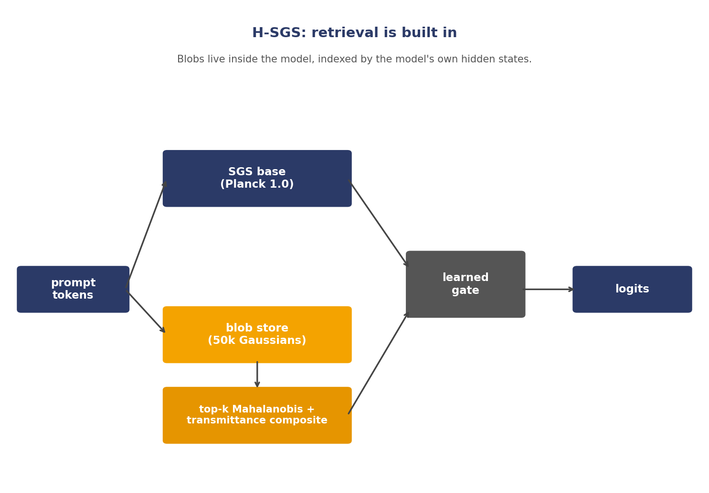
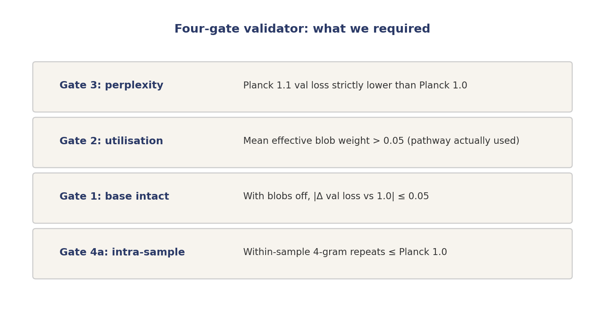
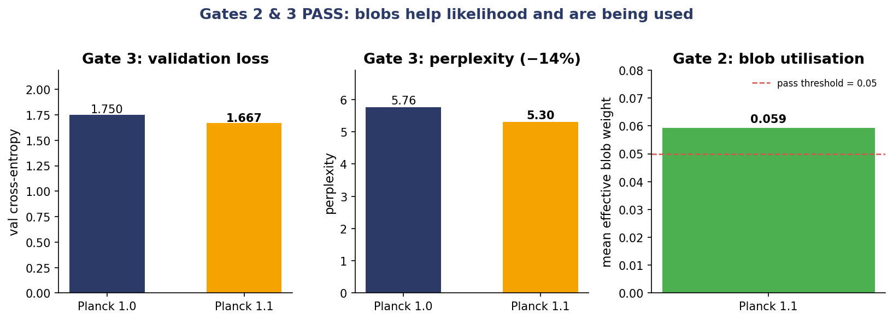
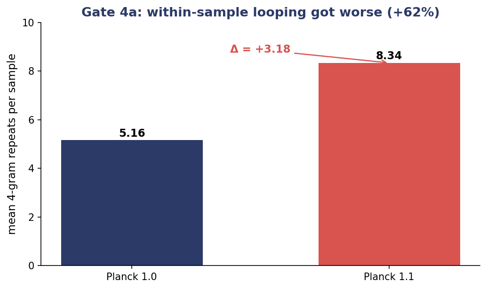
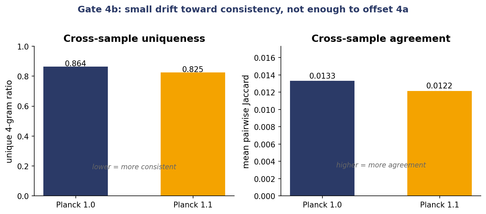
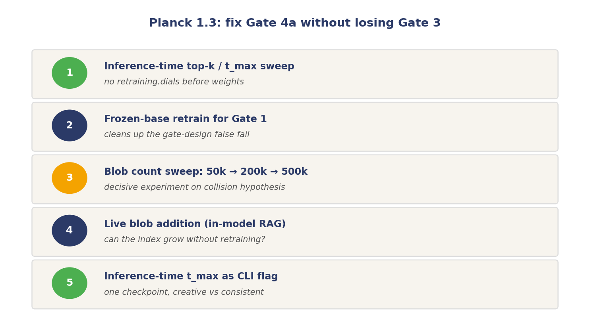

# Planck 1.1 LinkedIn Posts

Four-part LinkedIn series on Planck 1.1 and the H-SGS (Hierarchical
Semantic Gaussian Splatting) blob concept. Continues the SGS thread
that already covers Semantic Gaussian Splatting for text, Planck 1.0,
and the three Klang posts on the audio track.

Tone: formal, technical narrative. No em dashes. No "not X, but Y"
contrastives. No evaluative AI adverbs. Plain language for the idea,
precise numbers for the results.

Images live in `planck-posts/` and are generated by
`scripts/plot_planck11_posts.py` from `results/planck11_validation.json`.

---

## Post 1. The blob concept, and why the architecture is already a RAG

Continuing the SGS series.

Earlier posts introduced Semantic Gaussian Splatting as a
representational primitive for sequence modelling, and Planck as the
small language model built on that foundation. This post introduces
the next layer. We call them blobs.

Take a trained Planck, run it over a large corpus, cluster the hidden
states. Each cluster is a region of the model's own meaning space. We
keep one Gaussian per cluster with a centre, a covariance, an opacity,
and a feature payload. That collection is the blob store. At inference
each position looks up its top-k blobs by Mahalanobis distance,
composites their payloads under SGS transmittance, and a learned gate
decides how much of the blob signal to mix into the prediction.

Three properties fall out of that construction.

One, the blob store is a retrieval index by construction. Top-k
Mahalanobis in the model's own embedding space is nearest-neighbour
search. The gate is a relevance filter trained end-to-end against the
model's own loss. No separate retriever, no separate embedder, no
bolt-on. The RAG is built in.

Two, the index can grow without retraining the base. New blobs are new
Gaussians, and the gate already knows how to down-weight irrelevant
lookups. This is a path to in-model memory that grows over time.

Three, blobs are frequency-weighted by construction. Common concepts
produce high-opacity blobs, rare ones produce low-opacity blobs, and
the model's confidence on common ground becomes structurally explicit.

Targeted use cases: factual answers to the same question, code
generation, search and QA. All three benefit when similar prompts
resolve to the same top-k and produce consistent output.

The next post describes how we tested it.

---

## Post 2. Planck 1.1, what we were trying to prove

Continuing the SGS series.

Planck 1.1 is the first concrete test of the H-SGS blob claim.

Setup. Run Planck 1.0 (100M params, SGS, trained on TinyStories) over
the training set. Cluster the hidden states into 50,000 Gaussians via
k-means++. Add a small projection plus a learned gate on top. Fine-tune
on TinyStories with the base unfrozen. Top-k = 8, transmittance cap =
0.3.

We wrote a four-gate validator to answer four different questions.

Gate 3, perplexity. Does adding blobs lower validation loss vs
Planck 1.0? The headline question. If blobs do not help likelihood,
nothing else matters.

Gate 2, utilisation. Is the blob pathway actually being used at
inference, or has the learned gate silenced it? Mean effective blob
weight must sit above 0.05.

Gate 1, base intactness. If we silence the blobs (t_max = 0), does the
model fall back to something close to Planck 1.0? A pass means blobs
are additive, not a crutch.

Gate 4, generation quality. Does the retrieval pathway bias decoding
toward repeated text? Measured directly on 50 samples per model.

Together the four gates test whether blobs are a real architectural
feature or a side-effect of more training. Results in the next post.

---

## Post 3. Preliminary results

Continuing the SGS series.

Numbers from the first full run.

Gate 3, perplexity. Val loss 1.7504 to 1.6672. Perplexity 5.76 to
5.30. A 14 percent relative reduction. Pass.

Gate 2, utilisation. Mean effective blob weight 0.059, above the 0.05
floor. The gate is using the blob pathway at inference. Pass.

Gate 1, base intactness. With blobs silenced, Planck 1.1 val loss was
1.6669, not 1.7504. The base got better by the same magnitude as the
blobs did. The fine-tune unfroze the base, so "blobs off" is not
Planck 1.0 plus-minus noise, it is Planck 1.0 after more training.
This gate as specified cannot separate the two. A frozen-base retrain
is queued for Planck 1.3.

Gate 4, repetition. First version counted repeated 4-grams across 50
samples per model: 258 for Planck 1.0, 417 for Planck 1.1. That
aggregate number collapses two different behaviours. Looping inside a
single sample is a failure mode. Agreement across different samples
of the same prompt is the main upside of the blob architecture for
factual and code output. The aggregate cannot tell them apart.

We split Gate 4 in two. Gate 4a counts within-sample 4-gram repeats
and averages per sample. This is the new hard gate. Gate 4b reports
unique-n-gram ratio and pairwise Jaccard across samples of the same
prompt, informational only. Rerun in flight.

---

## Post 4. Gate results and the Planck 1.3 plan

Continuing the SGS series.

Rerun numbers on the split Gate 4.

Gate 4a, intra-sample repetition. Mean repeated 4-grams per sample:
Planck 1.0 = 5.16, Planck 1.1 = 8.34. Delta +3.18, a 62 percent
relative increase. Pass condition was 1.1 less-than-or-equal to 1.0.
Fail.

Gate 4b, cross-sample diversity. Unique-4-gram ratio 0.864 to 0.825.
Mean pairwise Jaccard 0.0133 to 0.0122. Both move toward consistency,
which is the direction we wanted for factual and code output, but by
4 to 9 percent. An order of magnitude smaller than the Gate 4a
regression it would have to offset.

Net read. The mechanism works. Blobs lower likelihood measurably and
the learned gate is using them at inference. In this configuration
the retrieval pathway also pulls generations into loops inside a
single sample more than it pulls different samples of the same prompt
into agreement. The property we wanted shows up weakly; the property
we did not want shows up strongly.

Decision. H-SGS does not enter Hertz 1.2 in this configuration.
Hertz 1.2 ships on the acceleration recipe already planned, without
blobs. The blob track moves to Planck 1.3.

Planck 1.3 plan, five items ordered by cost.

1. Top-k and transmittance-cap sweep on the existing checkpoint. No
retraining. Tells us cheaply whether Gate 4a can be dialled out at
decode.
2. Frozen-base retrain for Gate 1. Isolates the blob head so the
ablation is diagnostic. Cheap and independent.
3. Blob count sweep, 50k to 200k to 500k. Primary hypothesis for the
Gate 4a failure is blob collision: a small store forces similar
contexts onto the same top-k and the retrieval pathway pulls decoding
toward a narrow attractor set. More blobs spread that pull. This is
the decisive experiment.
4. Live blob addition. Freeze the model, append blobs built from a
held-out slice, check whether new prompts route to new blobs and
whether Gate 3 improves on the held-out slice without retraining.
The architectural test of the built-in RAG framing.
5. Inference-time transmittance dial as a CLI flag. One checkpoint,
two modes: high cap for factual and code, low cap for creative.

Per-domain blob shards move to Hertz 2.x. The idea needs a larger
model and a more diverse corpus than TinyStories to be testable.

The headline from Planck 1.1 stands. Retrieval is real and useful for
likelihood. Whether it can be made safe for generation at the same
time is the Planck 1.3 question. That is the condition for blobs
rejoining the Hertz track.

