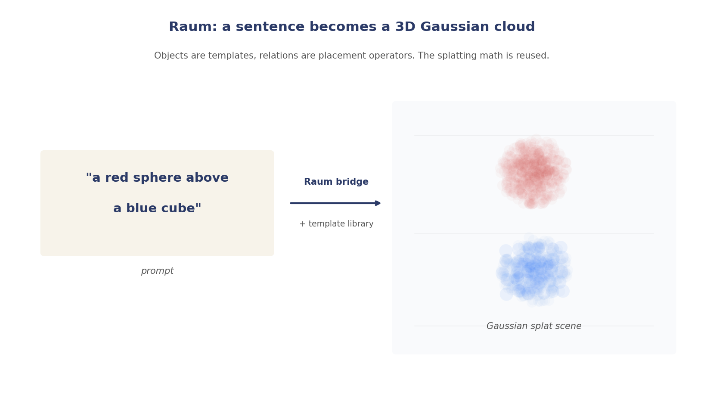
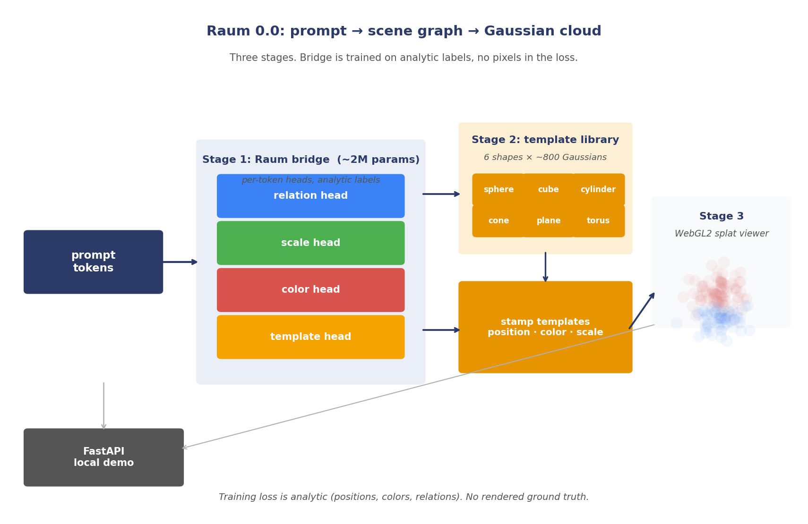

# Raum LinkedIn Posts

Three-part LinkedIn series on the Raum 3D track of the SGS project.
Continues the SGS thread that covers Semantic Gaussian Splatting for
text (Planck), for audio (Klang), and now for 3D (Raum).

Tone: formal, technical narrative. No em dashes. No "not X, but Y"
contrastives. No evaluative AI adverbs. Plain language for the idea,
precise numbers for the results.

Images live in `raum-posts/` and are generated by
`scripts/plot_raum_posts.py`.

---

## Post 1. Raum, the 3D idea

Continuing the SGS series.

Earlier posts on this thread made the case for Semantic Gaussian
Splatting as a representational primitive that transfers across
modalities. Planck showed it on text, Klang on audio. Raum is the
third arm, the one most people associate the words "Gaussian
splatting" with in the first place. 3D.

The framing is deliberately narrow. 3D Gaussian Splatting is a
reconstruction technique, typically fit from multiple photographs.
Raum inverts the direction. You do not give it photographs. You give
it a sentence. The model produces the Gaussian cloud that, rendered
from any angle, matches what the sentence describes.

"A red sphere above a blue cube." The model reads six tokens, decides
which are objects and which are relations, assigns each object to a
template in a small shape library, places each template in space by
the relation word, and emits a cloud of Gaussians. A standard
WebGL splat renderer draws them. The whole round trip runs locally.

The thesis Raum is built to test is simpler than the demo it
produces. If SGS is a real multimodal primitive, the same compositing
math that puts meaning Gaussians on a causal axis in Planck should put
visual Gaussians in 3D space in Raum. Objects are templates.
Relations are placement operators. The language model's job is to
choose among them. The splatting math stays the same.

We started with the smallest version of that claim we could ship:
a six-shape template library (sphere, cube, cylinder, cone, plane,
torus), two objects per scene, one relation, analytic labels. Raum
0.0 is that version wrapped in a web demo.

The next post describes how it is built.

---

## Post 2. How Raum 0.0 is built

Continuing the SGS series.

Raum 0.0 is a three-stage pipeline. Prompt in on the left, Gaussian
cloud out on the right, web viewer in between.

Stage 1, the bridge. A small encoder reads the prompt tokens and
emits, per token, four heads. A template head picks which of the six
shapes a given token refers to. A color head picks an RGB. A scale
head picks a size. A relation head pairs adjacent object tokens and
decides the spatial offset ("above", "below", "left of", "right of",
"on", "behind"). The bridge is trained on procedurally generated
scenes with analytic labels, so we never need a rendered ground truth
during training. The whole model is about 2M parameters.

Stage 2, the template library. Each of the six shapes is a
precomputed cloud of around 800 Gaussians with positions, colors, and
opacities baked into a static tensor. At inference time, for every
object slot that the bridge marked resolved, we stamp a copy of the
corresponding template into the scene, shifted by the position the
bridge predicted, tinted by the color head, scaled by the scale
head. The library is a lookup.

Stage 3, the renderer. The stamped Gaussians stream to a WebGL2
canvas in the browser. Camera control, splat shader, alpha
compositing, all standard. The user sees the scene rotate live and
can orbit it. The app is a single static page plus a FastAPI
endpoint that calls the bridge.

Two things are worth noticing. One, the bridge is analytic-only. The
loss has no pixels in it. That keeps the experiment honest: the
language model either learns the semantic decomposition or it does
not, and we do not hide bad decompositions behind a nice render.
Two, the model is small enough to run on a laptop. The point of 0.0
was not to produce pretty pictures. The point was to show the
pipeline end to end.

The architecture diagram is in the image below. Next post covers
what works and what does not.

---

## Post 3. Raum 0.0 results, and the path to 0.1

Continuing the SGS series.

What the demo does well. Two-object prompts with a single relation
resolve cleanly. "A red sphere above a blue cube" produces a red
sphere above a blue cube. "A green cone to the left of a yellow
torus" produces a green cone to the left of a yellow torus. The
relation head gets direction right on the validation set well above
chance. The six-shape templates stamp without artefacts after a
pair of rendering fixes (depth write on, a hard core with soft rim
shader to prevent color bleed in overlaps, a cylinder-cap seam fix).

What the demo does not do. Three objects break. "A red plane below
a blue cube above a green cone" renders two of the three correctly
and discards the third, because the bridge was only trained on
two-object scenes and the pair loss was anchored to slots 0 and 1.
Chained relations fail for the same reason. Unknown nouns fall
through to an unresolved warning.

This was the expected ceiling of a 0.0. The point of a 0.0 is to
confirm the pipeline works end to end, and it does. The next
iteration is where the interesting problems live.

Raum 0.1 is already planned. Three expansions.

One, complex scenes. The data generator is extended to emit
three- and four-object scenes with an anchor-object pointer so
"C to the right of B" uses B as the anchor. The pair loss becomes
order-invariant. The template library grows from six mathematical
primitives to around thirty everyday objects.

Two, out-of-vocabulary handling. Nearest-neighbour lookup over the
template library gates by cosine similarity. If the word is too far
from anything we know, the unresolved warning stays, and the demo
says so.

Three, the interesting one. A planner-executor split. A user typing
"castle on a hill in the jungle" does not want to name primitives.
They want a scene. We add a Planck-class planner in front of the
bridge that decomposes the prompt into a small scene-graph DSL
("castle is composed of these templates in these relations", "hill
is a scaled sphere", "jungle is a scatter of trees"). The bridge
becomes an executor for that DSL. The demo exposes the DSL as an
editable panel, so the user can correct the planner's decomposition
in place, the way image tools let you edit a generation without
retyping the whole prompt. A nano-banana for 3D scenes, built on
small SGS-native models end to end.

The planner will be trained on a procedural dataset generated from
the same grammar that drives the executor's training data, with a
second pass of paraphrased pairs. We stay on our own model family
for two reasons. Cost at demo scale. And thesis consistency: if the
pitch is "small SGS models do what frontier RAG does", the planner
cannot be a frontier LLM.

0.0 is done. 0.1 is the one to watch.

*(Screenshots of the 0.0 demo to follow.)*
